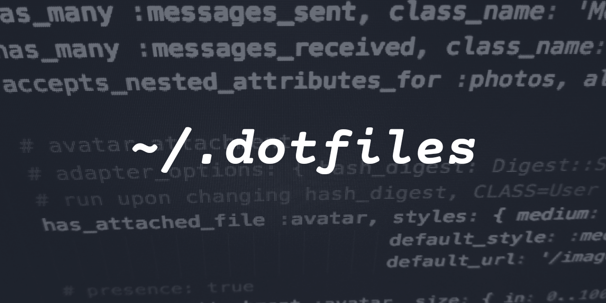
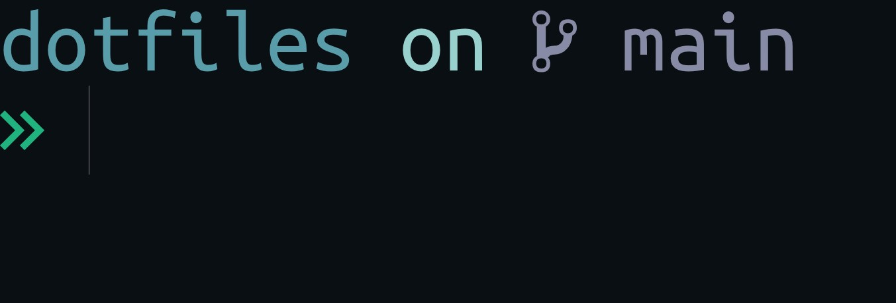

  

<h1 align=center>Dotfiles</h1>

<h4 align=center>
These are my configuration files aka dotfiles
</h4>

### Things included out of the repo -

- _**dotfiles**_ -

  - .bashrc
  - .bash_profile
  - .gitconfig
  - .gitignore
  - .inputrc
  - .npmrc
  - .config/starship.toml
  - tabliss.json ( settings for tabliss )
  
- _**VSCode Settings**_ -

  I've tried to include VSCode settings as well, although that may keep changing. You can find them in the [Setup]("./Setup.md").

  VSCode has a settings sync feature which helps you manage your settings across your instances automatically.

- _**Some Fonts as well**_

  List of fonts I use -

  - Anonymous Pro
  - Ubuntu Mono
  - mononoki
  - Fira Mono

  Some other nice but paid fonts include -

  - Dank Mono
  - Operator Mono

For more details, check [Setup.md](./Setup.md)

  

